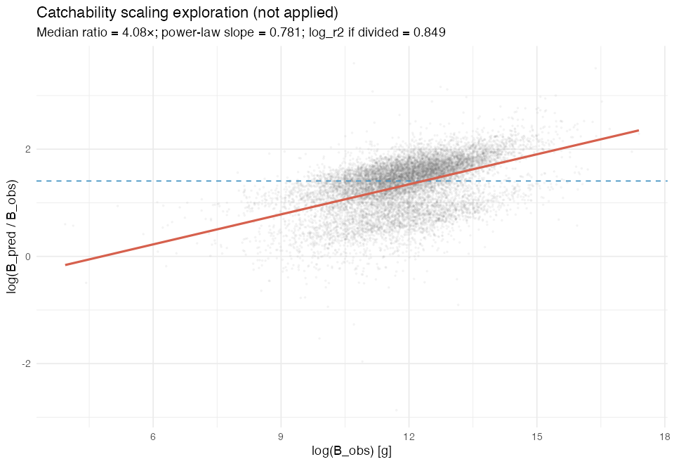

# H1 catchability scaling exploration

Generated: 2026-07-13 — **exploratory only; no correction applied to the pipeline.**

## Question

EEoS systematically overpredicts catch biomass (median `B_pred/B_obs` ≈ **
4.08
×**). Is this a stable multiplicative catchability offset that could be removed with a single scaler?

## Findings

- **Median ratio:** 4.08× (constant multiplicative overprediction if catchability were uniform)
- **Mean log-ratio:** 1.322 (≈ log(3.75))
- **Power-law** `log(B_obs) ~ a + b × log(B_pred)`: intercept = 1.576, slope = **0.781** (1.0 = proportional scaling)
- **log_r2** without correction: **-0.223**
- **log_r2** if every `B_pred` were divided by the median ratio (exploratory): **0.849**

### Quartile instability (why a naive fix is risky)

| Quartile | log(B_obs) range | Median B_pred/B_obs |
|----------|------------------|---------------------|
| Q1 | 3.9–11.1 | 3.07× |
| Q2 | 11.1–11.9 | 3.87× |
| Q3 | 11.9–12.7 | 4.51× |
| Q4 | 12.7–17.4 | 5.47× |

Overprediction **increases with observed biomass** (3.1× → 5.5×), so a single catchability multiplier is **not** adequate.

### Correlation of log-ratio with predictors (H2 confound check)

| Predictor | cor with log(B_pred/B_obs) |
|-----------|---------------------------:|
| ln_B_obs | 0.487 |
| ln_E_raw | 0.705 |
| log_N | 0.671 |
| log_S | 0.050 |

## Recommendation (no implementation)

1. **Do not** apply a global `B_pred / median_ratio` correction in H1 — it would artificially inflate log_r2 without validating the catchability mechanism.
2. **Do not** use biomass-dependent scaling in H2 without explicit fishing-pressure adjustment — ratio correlates with `log(B_obs)`.
3. **Carry forward** the scale-dependent offset as a design constraint: H2/H3 use **mean absolute residual** magnitude, not calibrated absolute biomass.

*Outputs: `outputs/h1_catchability_scaling_summary.csv`, `outputs/h1_catchability_by_quartile.csv`.*
