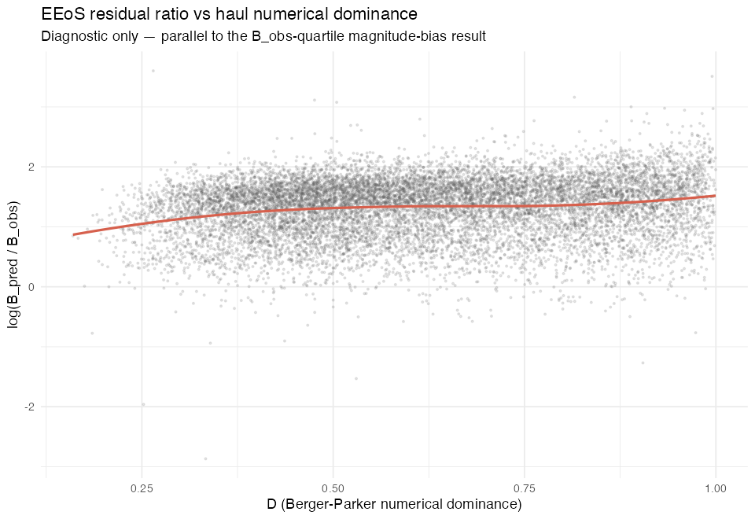
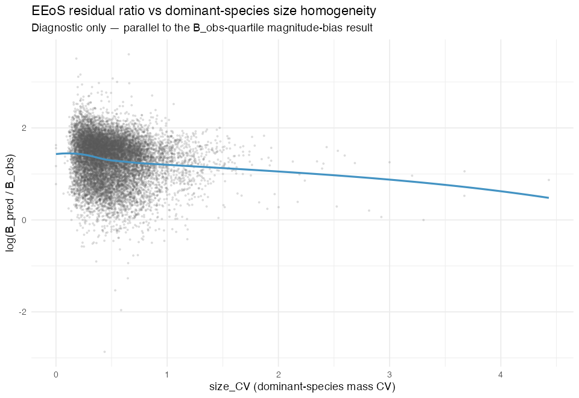

# Haul-level dominance and size-homogeneity as a second axis of EEoS prediction failure

**Results summary — structured against the original briefing.**
Generated: 2026-07-19. Parallel diagnostic track: does not modify the primary H1 pipeline
(log_r2/cor², null model, join/dropout fixes, catchability-scaling work), all of which
proceed unchanged.

Full per-haul data, all confound-check tables, and both figures are in `outputs/h1_dominance_*`
and `outputs/figures/h1_dominance_*`; the underlying script is
[`pipeline/explore_h1_haul_dominance.R`](../pipeline/explore_h1_haul_dominance.R). This document
summarises the results; the auto-generated companion log is
[`H1_dominance_size_homogeneity_exploration.md`](H1_dominance_size_homogeneity_exploration.md).

**Sample:** 12,069 hauls — the full EEoS prediction set (`haul_eeos_predictions.rds`), matched
back to `haul_key` with zero loss. `D`'s denominator (`N_haul`) was validated against the
production `N` column used in the EEoS call itself: 0 mismatches across all 12,069 hauls.

---

## Question

Does EEoS prediction failure vary systematically with how "typical" a haul's community
structure is, independent of (or conditional on) the biomass-magnitude bias already reported
(median predicted/observed ratio rising from ~3× in the lowest `B_obs` quartile to >5× in the
highest)? Motivating idea: a haul dominated by one species at a near-uniform size (a shoal/
cohort) is close to the theoretical minimum-entropy configuration relative to METE's well-mixed,
size-independent placement assumption, and should show larger prediction failure under METE's
own logic — not merely as a data artefact.

---

## Metric 1: Numerical dominance (D)

`D = n_max_species / N_haul`, Berger-Parker dominance, computed from the same SubFactor-raised
DATRAS HL abundance (LW-matched bins) already used for `N` in the EEoS call — not FishGlob
`num_cpue`.

| Statistic | Value |
|---|---|
| Min | 0.160 |
| Median | 0.601 |
| Mean | 0.617 |
| Max | 0.9998 |
| IQR | 0.459 – 0.780 |

No haul is numerically co-dominated (D never falls below ~0.16); the median haul has its single
most abundant species making up 60% of all raised individuals. D is reported continuous, unbinned,
in the per-haul table (`outputs/h1_dominance_haul_table.csv`), alongside `dominant_aphia_id` /
`dominant_species`.

## Metric 2: Dominant-species size homogeneity (size_CV)

Raised-count-weighted CV of bin-level LW mass (`W = a·L^b` per 1cm bin, not a single mean length)
for the dominant species' own length bins in that haul.

| Statistic | Value |
|---|---|
| Min | 0.000 |
| Median | 0.454 |
| Mean | 0.505 |
| Max | 4.432 |
| IQR | 0.325 – 0.623 |

**Edge case check:** `n_bins_dominant_species` (median 15, IQR 11–19) is reported alongside
`size_CV` as required. Only **11 hauls (0.1%)** have ≤2 length bins recorded for the dominant
species — the mechanically-near-zero-CV edge case the briefing flagged is rare in this dataset,
not a systematic feature of the low-`size_CV` tail (see the data-quality cross-check below for
the fuller test of this).

---

## Confound-check step

### 1. Correlation matrix

Pearson and Spearman r across hauls for `D`, `size_CV`, `N_haul`, `B_obs`, `n_bins_dominant_species`:

| Pair | Pearson r | Spearman r | Flag (\|r\|>0.4) |
|---|---|---|---|
| D — size_CV | −0.149 | −0.150 | |
| D — N | 0.262 | 0.363 | |
| D — B_obs | 0.156 | 0.137 | |
| D — n_bins_dominant_species | −0.153 | −0.162 | |
| size_CV — N | −0.105 | −0.242 | |
| size_CV — B_obs | −0.134 | −0.207 | |
| size_CV — n_bins_dominant_species | 0.430 | 0.429 | **✓** |
| N — B_obs | 0.524 | 0.746 | **✓** |
| N — n_bins_dominant_species | −0.029 | −0.100 | |
| B_obs — n_bins_dominant_species | 0.096 | 0.106 | |

**Only 2 of 10 pairs exceed the |r| > 0.4 threshold, and neither involves `D` or `size_CV` against
the outcome-adjacent variables (`N`, `B_obs`).** The two flagged pairs are both expected/mechanical:
`N`–`B_obs` is the already-known abundance–biomass relationship the primary result is built on;
`size_CV`–`n_bins_dominant_species` is a measurement-resolution effect (more recorded length bins
mechanically permit more captured size variation), which is exactly why `n_bins_dominant_species`
was carried as a companion column rather than folded into `size_CV`.

Critically: **`D` and `size_CV` are only weakly correlated with `B_obs` and `N`** (|r| ≤ 0.26 in
all four cases). Marginally, dominance and size-homogeneity are *not* simply re-describing the
biomass-magnitude bias through a different lens.

### 2. Conditional check (within B_obs quartile)

Correlation of `D` and `size_CV` with `ln_ratio` (`log(B_pred/B_obs)`), recomputed separately
within each existing `B_obs` quartile (same quartiles as the magnitude-bias result):

| B_obs quartile | n | D: Pearson r | D: Spearman r | size_CV: Pearson r | size_CV: Spearman r |
|---|---|---|---|---|---|
| Q1 (smallest) | 3018 | 0.040 | 0.067 | −0.052 | −0.070 |
| Q2 | 3017 | 0.130 | 0.145 | −0.057 | −0.064 |
| Q3 | 3017 | 0.098 | 0.104 | −0.048 | −0.067 |
| Q4 (largest) | 3017 | 0.168 | 0.171 | −0.108 | −0.148 |

Both relationships **survive conditioning on `B_obs` quartile, in the direction the motivating
hypothesis predicts, in every quartile**: higher `D` associates with a larger over-prediction
ratio; higher `size_CV` (a less size-homogeneous dominant-species catch) associates with a
*smaller* over-prediction ratio. The effect is modest in magnitude (r ≈ 0.04–0.17) and strengthens
somewhat toward the highest-biomass quartile, but it does not collapse to ~0 in any quartile —
i.e. dominance/size-homogeneity explain some residual variation *beyond* what biomass magnitude
already explains, consistent with step 1.

### 3. Data-quality cross-check

Bottom decile of `size_CV` (n = 1,207 of 12,069 hauls) cross-tabulated against known problem
years/rectangles, **compared against each grouping's baseline share of the full dataset** (not
just the raw count):

| Grouping | % of low-`size_CV` decile in flagged group | Baseline % of all hauls in flagged group | Enrichment |
|---|---|---|---|
| Flagged years (1985, 1998, 2013, 2014) | 13.3% | 13.0% | ~none (+0.3 pp) |
| Flagged rectangles (any nonzero EEoS-filter dropout, 45 of 187 rectangles) | 25.7% | 27.4% | **negative** (−1.7 pp) |

Low `size_CV` hauls are **not** concentrated in the years/rectangles already flagged for
historical data-quality issues — if anything, the rectangle check shows a slight *under*-
representation. Per `H1_dropout_diagnosis.md`, the 1998/2013–2014 spikes and 1985-only HL
coverage were historical NA-LW-propagation artefacts already fixed upstream (current
`datras_hl_raw.rds` build is `hl_bins_full`, 0 mean-length-fallback hauls), and this check
confirms the low-`size_CV` signal is not merely re-surfacing that already-resolved issue.
Combined with the rarity of the ≤2-bin edge case (0.1% of hauls, above), this supports reading
low `size_CV` as a genuine ecological signal (near-monotype catches) rather than an incomplete-
record artefact.

### 4. Taxonomic check (descriptive only)

Dominant-species identity in the extreme decile of each metric — **descriptive only, not used to
construct any species-based flag or filter**:

| Decile | Top 3 species | Combined share |
|---|---|---|
| D, top decile (most numerically dominated hauls) | *Trisopterus esmarkii* (27.3%), *Clupea harengus* (27.0%), *Sprattus sprattus* (26.4%) | **80.7%** |
| size_CV, bottom decile (most size-homogeneous dominant catch) | *Clupea harengus* (51.9%), *Trisopterus esmarkii* (22.4%), *Sprattus sprattus* (15.1%) | **89.4%** |
| size_CV, top decile (least size-homogeneous dominant catch) | *Melanogrammus aeglefinus* (32.4%), *Limanda limanda* (23.5%), *Merlangius merlangus* (14.7%) | **70.6%** |

The extremes of both metrics are concentrated but **not exclusive**: the classic small pelagic
schooling taxa (herring, Norway pout, sprat) account for the large majority — but not all — of
both the most numerically dominated hauls and the most size-homogeneous dominant catches, exactly
as the shoaling/cohort mechanism in the briefing's motivating idea would predict. The opposite
extreme (size_CV top decile — dominant species caught across a wide size range) is dominated
instead by demersal species with broad size/age structure in the catch (haddock, dab, whiting),
which is the ecologically expected mirror image. This distribution is a useful interpretive check
but, per the brief, should not be read as evidence for a species-specific rather than a
structural (dominance/homogeneity) effect — the conditional check above shows the effect holds
within `B_obs` quartile regardless of which species is driving any individual haul.

---

## Binned reporting

Format matches the existing `B_obs`-quartile magnitude-bias table (median ratio, n), with IQR
added. Full quartile, decile, and D×B_obs-quartile / size_CV×B_obs-quartile nested tables are in
`outputs/h1_dominance_by_D_bins.csv`, `outputs/h1_dominance_by_sizeCV_bins.csv`,
`outputs/h1_dominance_by_D_x_bobs_quartile.csv`, `outputs/h1_dominance_by_sizeCV_x_bobs_quartile.csv`.

### Table A — by D (Berger-Parker dominance)

| Quartile | D range | n | Median B_pred/B_obs | IQR |
|---|---|---|---|---|
| Q1 (least dominated) | 0.160 – 0.459 | 3018 | **3.70×** | 2.56–4.70 |
| Q2 | 0.459 – 0.601 | 3017 | **4.12×** | 2.78–5.21 |
| Q3 | 0.602 – 0.780 | 3017 | **4.20×** | 2.91–5.39 |
| Q4 (most dominated) | 0.780 – 1.000 | 3017 | **4.41×** | 2.99–5.83 |

### Table B — by size_CV (dominant-species size homogeneity)

| Quartile | size_CV range | n | Median B_pred/B_obs | IQR |
|---|---|---|---|---|
| Q1 (most homogeneous) | 0.000 – 0.325 | 3018 | **4.46×** | 3.06–5.80 |
| Q2 | 0.325 – 0.454 | 3017 | **4.18×** | 2.85–5.32 |
| Q3 | 0.454 – 0.623 | 3017 | **4.06×** | 2.69–5.11 |
| Q4 (least homogeneous) | 0.623 – 4.432 | 3017 | **3.73×** | 2.63–4.76 |

Both tables show a **monotonic gradient in the direction the motivating hypothesis predicts**:
overprediction rises from Q1→Q4 as dominance increases (3.70×→4.41×), and falls from Q1→Q4 as
size-homogeneity decreases (4.46×→3.73×). Both gradients are smaller than the primary `B_obs`-
quartile gradient (3.07×→5.47×) but are not negligible, and — per the conditional check above —
persist within every `B_obs` quartile rather than only appearing marginally. The nested tables
show the same D and size_CV gradients repeating inside each `B_obs` quartile (e.g. for size_CV
within the highest-`B_obs` quartile: 5.98× → 5.19× from most- to least-homogeneous), which is the
clearest evidence that this is a second, largely independent axis rather than a re-expression of
the magnitude bias.

`D` and `size_CV` are reported as two separate axes throughout, as instructed — no composite
dominance score has been constructed.

---

## Deliverables

| Deliverable | Location |
|---|---|
| Per-haul table (`haul_id`, `D`, `dominant_species`, `size_CV`, `n_bins_dominant_species`, `N_haul`, `B_obs`, `B_pred`, `pred_obs_ratio`, `B_obs_quartile`) | `outputs/h1_dominance_haul_table.csv` |
| Correlation matrix (step 1) | `outputs/h1_dominance_correlation_matrix.csv` |
| Conditional within-quartile relationships (step 2) | `outputs/h1_dominance_conditional_correlation.csv` |
| Data-quality cross-tab (step 3) | `outputs/h1_dominance_dataquality_by_year.csv`, `outputs/h1_dominance_dataquality_by_stat_rec.csv`, `outputs/h1_dominance_dataquality_summary.csv` |
| Taxonomic breakdown (step 4, descriptive) | `outputs/h1_dominance_taxonomic_breakdown.csv` |
| Binned table — D (quartile + decile + ×B_obs-quartile) | `outputs/h1_dominance_by_D_bins.csv`, `outputs/h1_dominance_by_D_x_bobs_quartile.csv` |
| Binned table — size_CV (quartile + decile + ×B_obs-quartile) | `outputs/h1_dominance_by_sizeCV_bins.csv`, `outputs/h1_dominance_by_sizeCV_x_bobs_quartile.csv` |
| Figures (ratio vs D; ratio vs size_CV) | `outputs/figures/h1_dominance_ratio_vs_D.png`, `outputs/figures/h1_dominance_ratio_vs_sizeCV.png` |

---

## Bottom line

Both proposed metrics show a gradient in the predicted direction, and both **survive** the
required confound checks:

- Marginal correlations with `B_obs`/`N` are weak (|r| ≤ 0.26) — this is not the magnitude bias
  re-labelled.
- The `D`–ratio and `size_CV`–ratio relationships persist, in the same direction, inside every
  `B_obs` quartile, including in the nested binned tables.
- The low-`size_CV` tail is not disproportionately drawn from known incomplete-record years or
  rectangles, and the ≤2-bin mechanical-CV edge case affects only 0.1% of hauls.
- The taxonomic pattern at both metrics' extremes is concentrated in classic shoaling pelagics
  (herring, Norway pout, sprat) at the "high failure" end and broader-size demersal species at
  the low-dominance / high-size_CV end — consistent with, though not proof of, the METE
  minimum-entropy mechanism proposed in the brief.

The effect sizes are modest relative to the primary biomass-magnitude gradient (D: 3.70×→4.41×
and size_CV: 4.46×→3.73×, vs. 3.07×→5.47× for `B_obs` quartile) and the two metrics are themselves
only weakly correlated with each other (r ≈ −0.15), so they should continue to be tracked as two
separate, non-additive candidate explanations rather than combined into a single index, per the
brief. As with the catchability-scaling exploration, **no correction has been applied** — this
is a diagnostic characterisation of the residual structure, not a proposed fix.

---

*Nothing else changes: H1 primary metric (log_r2, cor²), null model, dropout diagnostics, and
catchability-scaling work are unaffected by this parallel diagnostic track.*
