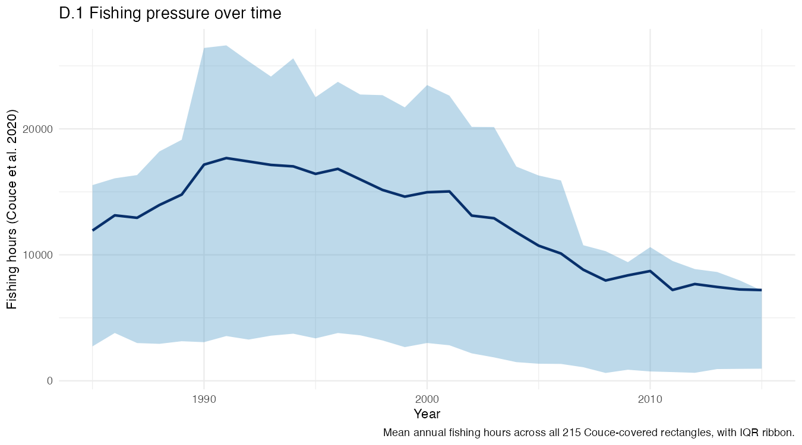
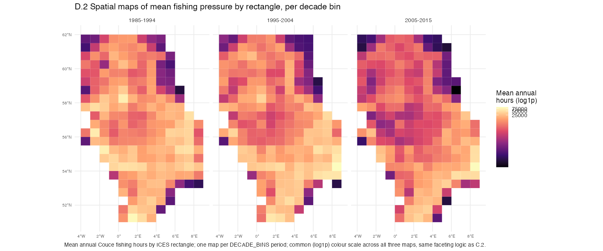
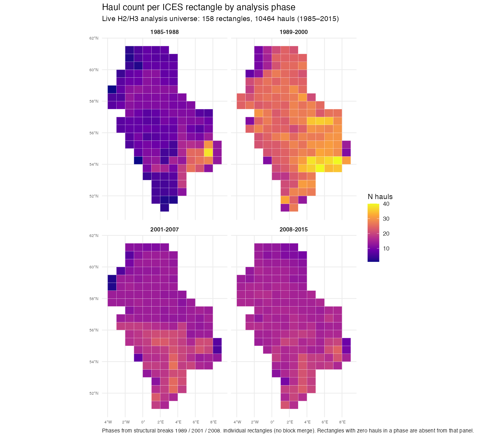
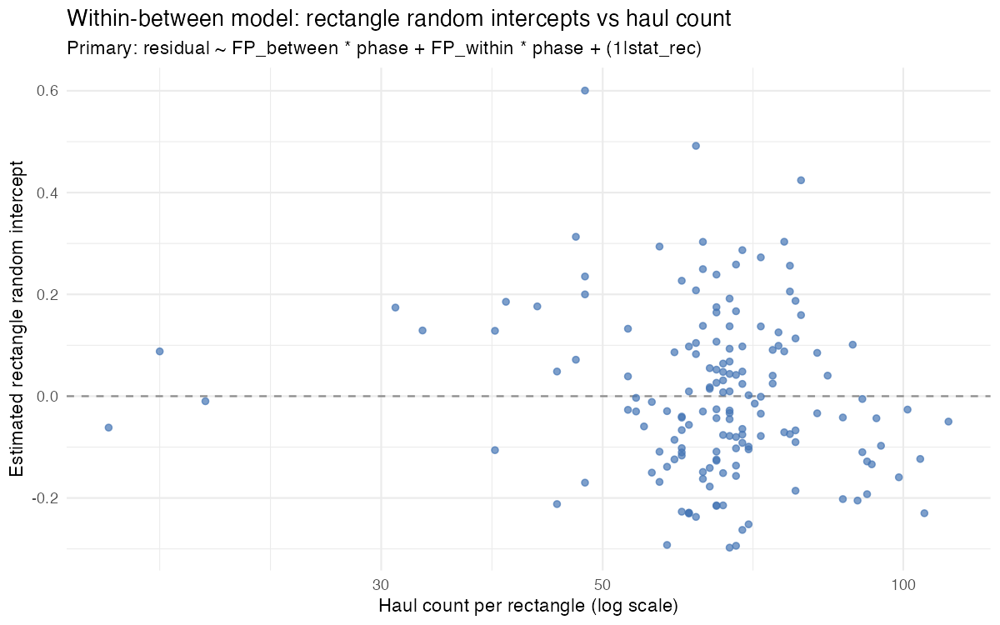

Justification and explanation for methodological approach to H2/ H3 based on exploratory analysis

**Exploratory analysis found that fishing pressure is varied at the rectangle level**
- **Between-rectangle variance**: how much rectangles differ from each other in their *typical* (average) fishing-pressure level, ICC = 59% of the variance in fishing pressure
- **Within-rectangle variance**: how much a single rectangle's value bounces around from year to year, around its own typical level, ICC = 41% of the variance in fishing pressure

Fishing pressure shows clear temporal trend changes over ~10 year periods:

Fishing pressure is not evenly distributed spatially, showing clear clusters of high / low pressure, and change within ~10 year periods:

**Spatial unit =** Individual rectangles

Most rectangles are sampled only 1–2 times a year, too few to analyse independently. Survey coverage is also uneven across the map and across the four analysis phases (primary: policy-anchored `phase_v2` at 1992 / 2002 / 2008; haul-count map below still shows the earlier data-driven phase windows):

Haul count is also not distributed evenly spatially; this is accounted for in the modelling approach using **partial pooling**. The random intercept lets each rectangle borrow strength from the overall pattern rather than being treated alone: rectangles with many hauls keep intercepts closer to their own data, while sparsely sampled rectangles are shrunk toward the shared mean — so well-sampled areas carry more weight without discarding poorly sampled ones.

**Haul count vs residual metrics (supervisor diagnostic):** Partial pooling addresses unequal *information* for inference; separately we screened whether rectangle residual metrics themselves trend with *n* hauls (`pipeline/run_h2_n_hauls_metric_diagnostics.R`; full write-up [H2_n_hauls_metric_check.md](H2_n_hauls_metric_check.md)). A wedge-shaped reduction in metric SE with increasing *n* is expected as averages converge and does not indicate bias. Overall rectangle means showed no linear association with haul count (|Spearman| &lt; 0.25). A phase-specific association in 2001–2007 triggered weighted / drop-low-*n* sensitivities of residual ~ `FP_between`; slopes kept the same sign and similar magnitude, so the primary within–between model was left unchanged.

**Temporal break points:**
**Primary phase structure (`phase_v2`):** policy-anchored breakpoints at **1992 / 2002 / 2008**,
giving phases 1985–1991 / 1992–2001 / 2002–2007 / 2008–2015 (CFP reforms; 2008 LTMP / MSFD).

**Design history / sensitivity:** a structural-break analysis located **3 statistically
robust breaks (1989, 2001, 2008)**. A candidate 4th break (1997) had only marginal
statistical support and is not used. Those data-driven phases informed early design;
they are not the presented primary.
- Breaks were detected by fitting `strucchange::breakpoints()` (Bai–Perron) to the whole-area mean fishing-hours series — 31 annual points, 1985–2015, 
pooled across all 215 rectangles — allowing both intercept and slope to shift at each break.
- This only quantifies breaks over the whole fishing pressure time series (not aggregated down to individual rectangle / years).
- The 2001 Bai–Perron break overlaps the 2002 CFP reform window — useful corroboration that a mid-study transition is real in the fishing-hours series, even though the primary model now uses the policy dates directly.

**Model: Mixed effects**
A single model tests both hypotheses, using the within-between decomposition of
fishing pressure

- **H2 (spatial)**: `FP_between × phase_v2` (CAR between slopes for reporting), with
rectangle-level spatial autocorrelation accounted for.
- **H3 (temporal)**: significant `FP_within × phase_v2` interaction — whether a
rectangle's own year-to-year fishing-pressure fluctuation's association with its
own residual differs across the four policy-anchored time phases.

A rectangle enters as a random intercept (`(1 | rectangle)`),
Spatial autocorrelation between neighbouring rectangles is incorporated directly into this random-effects structure, e.g. a spatial correlation function over rectangle centroids.
Fishing pressure enters as a fixed-effect covariate at the rectangle-year level (its natural resolution in the Couce dataset).

**Decomposition**

Rectangle-year fishing pressure (`log(fishing_hours + 1)`, its natural resolution in the Couce dataset) is decomposed into a **between-rectangle** component and a **within-rectangle** component:

- `FP_between` — each rectangle's own mean fishing pressure across the whole study
period (time-invariant, one value per rectangle). This is the *spatial*
term, and is what answers **H2**: does a rectangle's persistent fishing-pressure
level predict its residual.
- `FP_within` — that rectangle-year's deviation from its own rectangle's mean
(time-varying, mean zero within each rectangle by construction). This is the *temporal* term, and is what answers **H3**: does a rectangle's own
year-to-year fluctuation in fishing pressure track its own residual.

**Exploratory analysis — for context but dropped**

Explored **making the zones bigger**, so each zone has enough samples to say something reliable. Eplored two ways of doing that:

- **Merging neighbouring rectangles into blocks** (e.g. 2×2 or 3×3 groups), regardless
of anything else about them.

When we merged rectangles into simple geographic blocks the ICC number dropped substantially — down to around 0.38–0.45 depending on block size.

- **Grouping rectangles by how much fishing happens there**, so a "zone" is a cluster
of rectangles that all experience similarly high (or low) fishing pressure.

Grouping rectangles by similar fishing pressure ICC = 0.52–0.53, **however** prediction-error
differences were preserved *worse* under fishing-pressure grouping than under the
simple geographic blocks. Plus fishing-pressure zones were also very unevenly sized.

- **The relationship between survey effort and fishing pressure is weak.**
