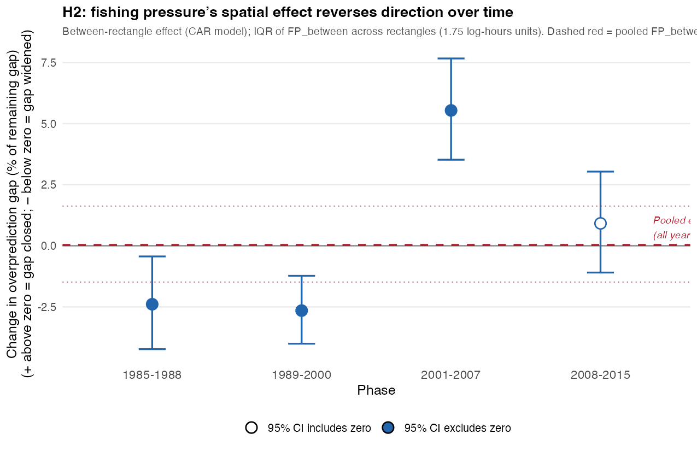

# H2 results – draft

*Updated July 2026: primary H2 narrative below uses the within-between decomposition (persistent between-rectangle fishing pressure, CAR-adjusted, phase-specific slopes). An earlier cross-sectional rectangle-scale analysis (OLS / SEM) is retained at the end for reference.*

---

## H2 — does a rectangle's persistent fishing-pressure level predict its prediction error?

| Phase | Effect | Significant? | Gap change (typical low- vs high-fishing rectangle) |
| --- | --- | --- | --- |
| 1985–1988 | Negative — persistently higher-fishing rectangles have a *larger* overprediction gap | Yes (p ≈ 0.017) | widened 2.4% [0.4, 4.2] |
| 1989–2000 | Negative, same direction | Yes (p ≈ 3.5×10⁻⁴) | widened 2.7% [1.2, 4.0] |
| 2001–2007 | Positive — reverses; higher-fishing rectangles now have a *smaller* gap | Yes (p ≈ 1.6×10⁻⁸) | closed 5.5% [3.5, 7.7] |
| 2008–2015 | No detectable effect | No (p ≈ 0.38) | closed 0.9% [−1.1, 3.0] (CI crosses zero) |

"Typical low- vs high-fishing rectangle" compares a rectangle at the 25th percentile of persistent fishing pressure to one at the 75th percentile, within the same phase (IQR of `FP_between` across rectangles).

These percentages reflect the fitted relationship across all 158 rectangles in each phase, adjusted for spatial autocorrelation; the raw, unadjusted correlation between a rectangle's persistent fishing pressure and its mean residual is weak in both early phases (r = −0.07 and −0.09, r² under 1%, not significant) but strengthens substantially post-2001 (r = +0.47, r² = 22% in 2001–2007; r = +0.29, r² = 9% in 2008–2015), consistent in direction with the adjusted slopes throughout.

Notably, the raw correlation remains statistically significant in 2008–2015 (p < 0.001) even though the spatially-adjusted model slope for that phase is not (p ≈ 0.38) — this is expected given the between-rectangle term's known sensitivity to spatial confounding, and is a direct illustration of why the CAR-adjusted, not raw, estimate is used as the primary H2 result.

Individual rectangles vary considerably around these fitted relationships (e.g. mean residual across rectangles spans −1.79 to −0.38 in 2001–2007), so the reported percentage describes a central tendency, not a bound on any one rectangle's actual shift.

*Sources: `outputs/h2h3_wb_proportional_effects_H2.csv`, `outputs/h2h3_raw_correlation_H2.csv`, `outputs/figures/h2h3_presentation_H2_gap_change_by_phase.png`.*

---
