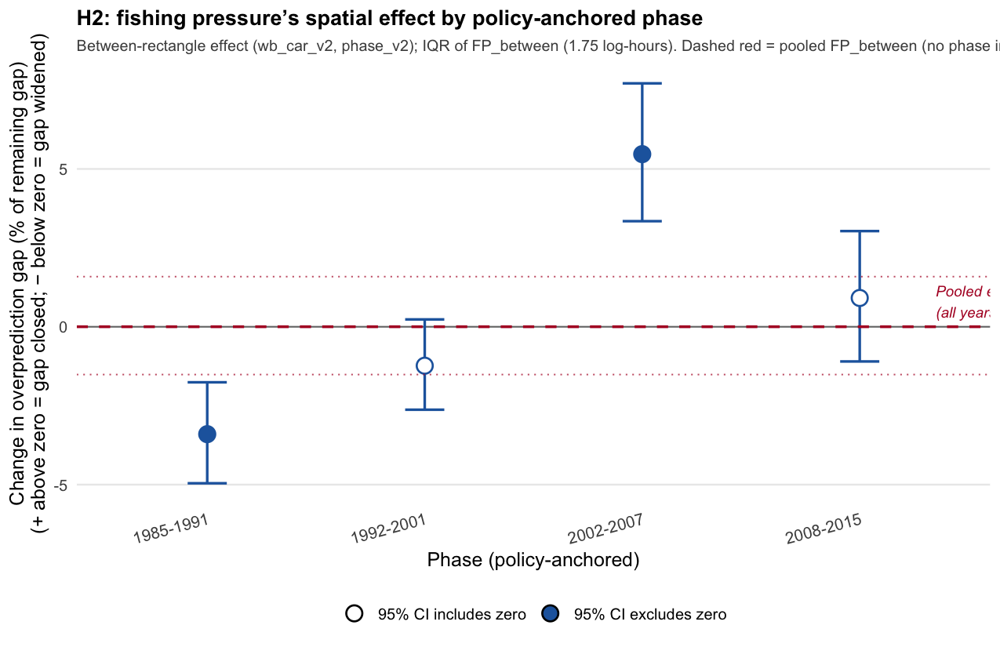

## H2 — does a rectangle's fishing-pressure level predict its prediction error?

| Phase | Effect | Significant? | Gap change (typical low- vs high-fishing rectangle) |
| --- | --- | --- | --- |
| 1985–1991 | Negative — persistently higher-fishing rectangles have a *larger* overprediction gap | Yes (p ≈ 8×10⁻⁵) | widened 3.4% [1.8, 5.0] |
| 1992–2001 | Negative — same direction, but not significant | No (p ≈ 0.098) | widened 1.2% [−0.2, 2.6] (CI crosses zero) |
| 2002–2007 | Positive — reverses; higher-fishing rectangles now have a *smaller* gap | Yes (p ≈ 1.3×10⁻⁷) | closed 5.5% [3.4, 7.7] |
| 2008–2015 | No detectable effect | No (p ≈ 0.38) | closed 0.9% [−1.1, 3.0] (CI crosses zero) |

"Typical low- vs high-fishing rectangle" compares a rectangle at the 25th percentile of persistent fishing pressure to one at the 75th percentile, within the same phase (IQR of `FP_between` across rectangles).

These percentages reflect the fitted relationship across all 158 rectangles in each phase, adjusted for spatial autocorrelation. Under `phase_v2`, only the first early window (1985–1991) shows a clearly significant negative CAR slope; 1992–2001 is negative but not significant. Raw, unadjusted correlations (still from the original-phase run; not yet recomputed for `phase_v2`) were weak in both early windows (r = −0.07 and −0.09, r² under 1%, not significant) but stronger later (r = +0.47, r² = 22% in the old 2001–2007 window; r = +0.29, r² = 9% in 2008–2015) — directionally consistent with the adjusted post-2002 pattern, pending a `phase_v2` raw-correlation re-run.

Notably, the raw correlation remains statistically significant in 2008–2015 (p < 0.001) even though the spatially-adjusted model slope for that phase is not (p ≈ 0.38) — this is expected given the between-rectangle term's known sensitivity to spatial confounding, and is a direct illustration of why the CAR-adjusted, not raw, estimate is used as the primary H2 result.

Individual rectangles vary considerably around these fitted relationships (e.g. mean residual across rectangles spans −1.79 to −0.38 in the mid-2000s peak window), so the reported percentage describes a central tendency, not a bound on any one rectangle's actual shift.

*Sources: `outputs/phase_v2_proportional_effects_H2.csv`, `outputs/h2h3_raw_correlation_H2.csv` (original-phase; not yet recomputed for phase_v2), `outputs/figures/phase_v2_presentation_H2_gap_change_by_phase.png`.*

---
