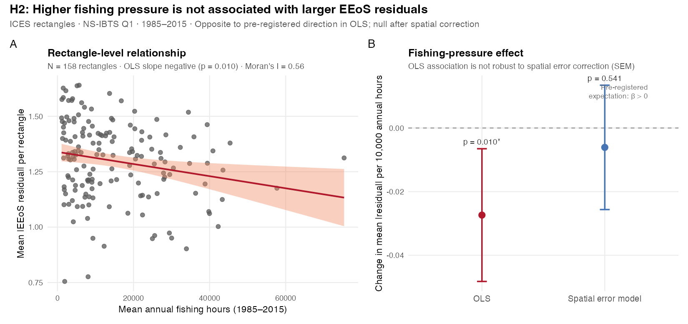

# H2 — EEoS residuals vs fishing pressure: results summary

**Survey:** NS-IBTS Q1 · **Period:** 1985–2015 · **Unit:** ICES rectangle (one observation per rectangle)

## Question

Do more heavily fished rectangles show larger mean |EEoS residual| — greater deviation between observed and EEoS-predicted biomass?

## Design

| Component | Definition |
|-----------|------------|
| Dependent variable (primary) | Mean `\|log(B_obs) − log(B_pred)\|` across hauls in rectangle |
| Independent variable | Mean annual reconstructed otter + beam trawling hours (Couce et al. 2020) |
| Panel | `r 158` rectangles with ≥ 10 hauls and Couce effort data |
| Spatial weights | Queen contiguity on ICES Statistical Rectangles |

## Headline results

**Primary OLS:** β = −2.7 × 10⁻⁶ hours⁻¹ (p = 0.010, N = 158, R² = 0.04). Higher fishing pressure is associated with **smaller** mean absolute residuals — opposite the pre-registered positive β expectation.

**Spatial error model:** β = −6.1 × 10⁻⁷ (p = 0.54, λ = 0.86). After spatial correction, fishing pressure is **not** a significant predictor of |residual|.

**Moran's I** on OLS residuals: I = 0.56, p ≪ 0.001 — strong spatial autocorrelation, as expected.

## Success criteria

1. **Positive significant OLS β** — **Not met** (β < 0).
2. **Positive significant β in SEM** — **Not met** (p = 0.54).

## Sensitivity

- Result direction is stable across min-haul thresholds (5, 10, 20).
- Beam trawl hours drive the negative OLS association; otter-only is not significant.
- Adding mean log(B_obs) as covariate flips the slope positive (p = 0.019), consistent with H1 catchability / scale-offset confounding in high-pressure areas.

## Limitations

- Couce effort is in fishing hours, not swept-area ratio.
- Hours-based trends may understate true seabed disturbance where gear power increased.
- Rectangle-level correlation does not establish causation.

## Files

| Output | Path |
|--------|------|
| Analysis panel | `outputs/h2_rectangle_panel.csv` |
| OLS results | `outputs/h2_ols_results.csv` |
| Spatial diagnostics | `outputs/h2_spatial_diagnostics.csv` |
| SEM results | `outputs/h2_sem_results.csv` |
| **Topline figure** | `outputs/figures/h2_topline_result.png` |
| Figures | `outputs/figures/h2_*.png` |
| Full report | `display_discussion/H2_results_draft.md` |

---

*Numbers from pipeline run on `outputs/h2_*.csv`. Fishing data: Couce et al. (2020), DOI 10.14466/CefasDataHub.61.*
