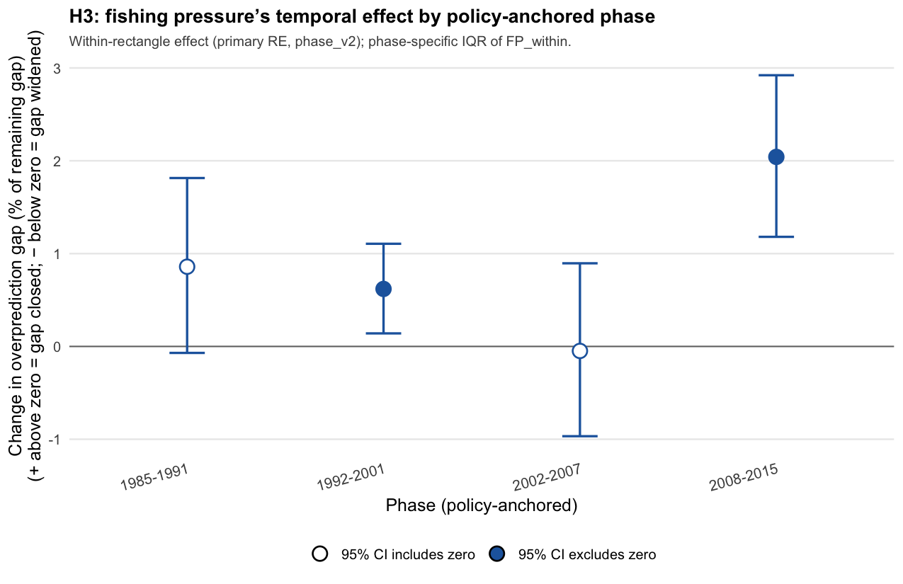

# H3 results – draft

*Updated July 2026: primary H3 narrative below uses the within-between decomposition (within-rectangle year-to-year fishing-pressure deviation, primary model, phase-specific slopes). Table numbers updated Aug 2026 for policy-anchored `phase_v2`.*

---

## H3 — does a rectangle's own fishing-pressure fluctuation track its own prediction error?

| Phase | Effect | Significant? | Gap change (rectangle's own low- vs high-fishing year) |
| --- | --- | --- | --- |
| 1985–1991 | None detected | No | closed 0.9% [−0.1, 1.8] (CI crosses zero) |
| 1992–2001 | Positive — a rectangle's own fishing-pressure rise tracks a smaller gap that year | Yes (p ≈ 0.011) | closed 0.6% [0.1, 1.1] |
| 2002–2007 | None detected | No | widened 0.05% [−1.0, 0.9] (CI crosses zero) |
| 2008–2015 | Positive, similar size to 1992–2001 | Yes (p ≈ 2×10⁻⁶) | closed 2.0% [1.2, 2.9] |

"Rectangle's own low- vs high-fishing year" compares that rectangle's 25th- to 75th-percentile year in terms of its own deviation from its long-run average fishing pressure (IQR of `FP_within` within that phase). A doubling-of-hours convention doesn't apply here, since this term is a mean-zero deviation, not an absolute level.

Raw correlation between a rectangle's own year-to-year fishing-pressure deviation and its residual is weak throughout (r = 0.05–0.16, r² under 3% in every phase; still from the original-phase run, not yet recomputed for `phase_v2`), consistent with the model's own low overall explanatory power (marginal R² = 0.051). Direction matches the adjusted model in three of four phases; in the mid-2000s window (old label 2001–2007; primary `phase_v2` equivalent 2002–2007), the raw correlation is positive and statistically significant (r = 0.14, p < 0.0001) while the adjusted within-rectangle slope is near zero and non-significant — flagged explicitly as a sign disagreement. This most likely reflects the raw correlation picking up spatial or between-rectangle structure that the adjusted model correctly attributes elsewhere, rather than a genuine within-rectangle effect in that phase; it should be read as a reminder that raw association and an effect properly isolated from other structure are different questions, not as a contradiction of the adjusted H3 result.

Individual rectangle-years vary widely around these relationships, occasionally showing a positive residual (theory underpredicting rather than overpredicting) at the extremes — single points, not to be over-interpreted.

*Sources: `outputs/phase_v2_proportional_effects_H3.csv`, `outputs/h2h3_raw_correlation_H3.csv` (original-phase; not yet recomputed for phase_v2), `outputs/figures/phase_v2_presentation_H3_gap_change_by_phase.png`.*
