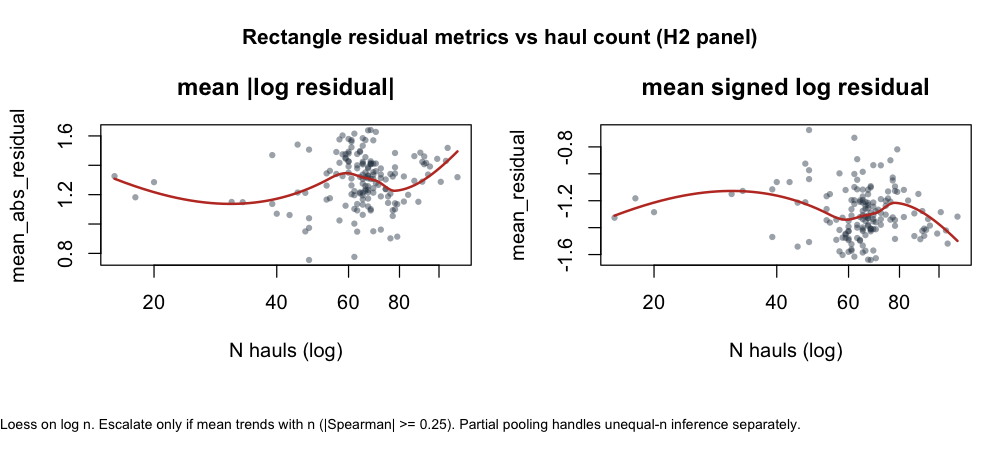
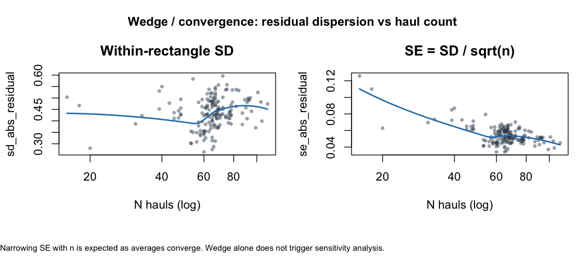
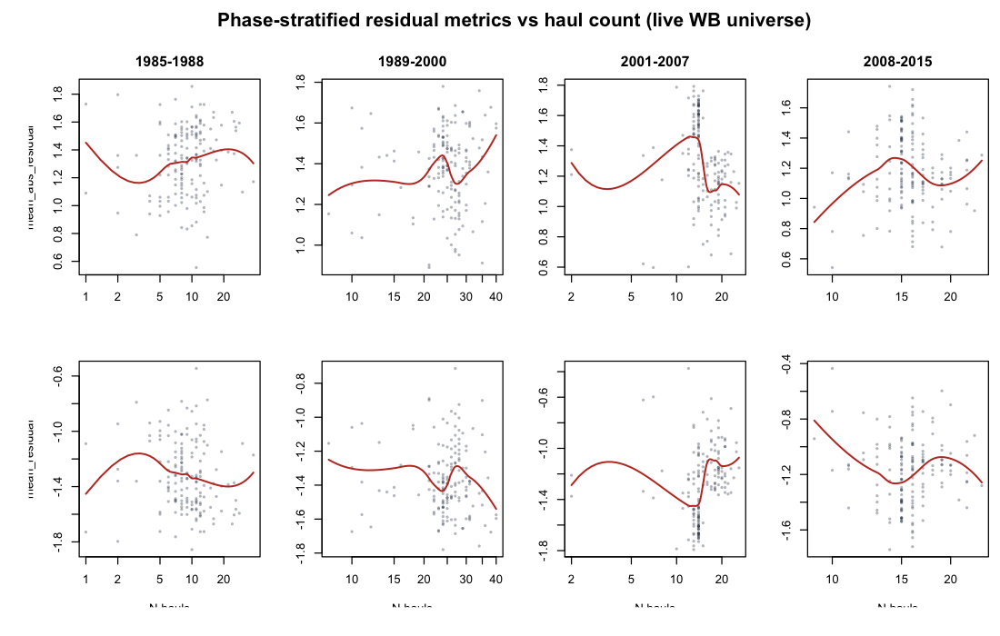

# H2 haul-count vs residual-metric check

**Purpose:** Address supervisor feedback on whether rectangle residual metrics are artefacts of unequal haul counts, and whether a wedge/funnel in precision with sample size needs action.

**Script:** `pipeline/run_h2_n_hauls_metric_diagnostics.R`  
**Outputs:** `outputs/h2_n_hauls_metric_diagnostics.csv`, `outputs/h2_n_hauls_metric_bins.csv`, `outputs/h2_n_hauls_metric_sensitivity.csv`, `outputs/h2_n_hauls_metric_run_log.md`, figures under `outputs/figures/h2_n_hauls_*`.

---

## What partial pooling already does

Unequal haul counts per ICES rectangle are handled in the primary within–between model by **partial pooling**: rectangle random intercepts with few hauls shrink toward the shared mean (Spearman(log *n*, shrinkage) ≈ 0.35). That answers unequal *information* for inference. It does **not** by itself document whether metric *values* trend with *n*.

## Diagnostic decision rule

1. **Wedge / convergence** in dispersion vs *n* (SE shrinking as averages converge) → expected; document; no action.
2. **Linear / monotone trend in central tendency** of the residual metric vs log(*n*) → escalate only if |Spearman ρ| ≥ 0.25.

## Results

**Overall (rectangle panel / full WB universe):** no mean trend with haul count (ρ ≈ 0.02 for `mean_abs_residual` and `mean_residual`). Expected SE wedge present (ρ(SE, log *n*) ≈ −0.30).

**Phase-stratified:** only **2001–2007** exceeded the mean-trend threshold (ρ ≈ −0.41 for mean |residual|, ρ ≈ +0.42 for signed mean residual — consistent with less-negative residuals where |residual| is smaller). Other phases were below threshold.

## Sensitivity (escalation for 2001–2007)

Rectangle-level OLS of residual metric ~ `FP_between` for 2001–2007:

| Spec | mean_abs slope | mean_residual slope |
|------|---------------:|--------------------:|
| Unweighted | −0.120 | +0.121 |
| Weight ∝ *n* | −0.121 | +0.122 |
| Weight ∝ 1/SE² | −0.083 | +0.084 |
| Drop lowest *n* decile | −0.127 | +0.130 |

Same sign and similar magnitude throughout. Dropping the sparsest decile did **not** remove the *n*–metric association, but it also did **not** change the `FP_between` association. Primary haul-level within–between model unchanged.

---

## Framing (for methods / supervisor)

Unequal haul counts per ICES rectangle are handled in the primary model by partial pooling: rectangle intercepts with few hauls shrink toward the shared mean. Separately, we screened rectangle-level residual metrics against haul count. A wedge-shaped reduction in metric SE with increasing *n* is expected as averages converge and does not indicate bias. Overall, no systematic linear association between haul count and residual-metric central tendency was observed (|Spearman| &lt; 0.25). A phase-specific association in 2001–2007 triggered weighted and drop-low-*n* sensitivities of residual ~ fishing pressure; slopes kept the same sign and similar magnitude, so no further adjustment to the primary model was applied.
