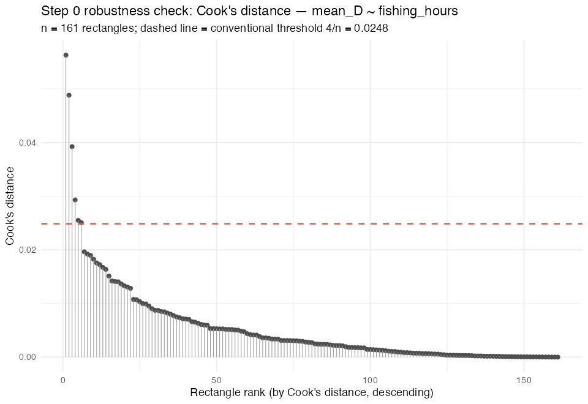
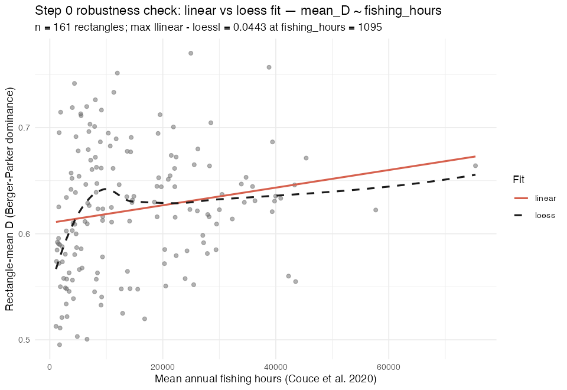

# Step 0 robustness check — D vs fishing-pressure correlation

Generated: 2026-07-20 — robustness check on the Step 0 cross-sectional D-fishing-pressure correlation (r = 0.183, R2 = 0.033, p = 0.020, n = 161). Does not modify the Step 0 pipeline/thresholds/outputs. Reported uninterpreted, as with Step 0 — interpretation is Stuart's call.

Rectangle counts: 187 total in step0_rectangle_panel.csv -> 161 retained (paired D + fishing hours) / 26 dropped (no Couce coverage).

## Check 1 — Pearson vs Spearman (D vs fishing_hours)

| method | statistic | p_value | n |
|---|---|---|---|
| pearson | 0.1829 | 0.0202 | 161 |
| spearman | 0.2464 | 0.0016 | 161 |

Supplementary (not requested) — size_CV vs fishing_hours, for consistency:

| method | statistic | p_value | n |
|---|---|---|---|
| pearson | 0.0826 | 0.2978 | 161 |
| spearman | 0.0988 | 0.2122 | 161 |

## Check 2 — Cook's distance / leverage (mean_D ~ fishing_hours)

Top 5 rectangles by Cook's distance (n = 161 total):

| stat_rec | mean_D | mean_annual_hours_total | cooks_distance | cooks_threshold_4_over_n |
|---|---|---|---|---|
| 45F0 | 0.7569 | 38805.710 | 0.0563 | 0.0248 |
| 41E7 | 0.5549 | 43508.968 | 0.0488 | 0.0248 |
| 43F7 | 0.5600 | 42260.516 | 0.0392 | 0.0248 |
| 34F2 | 0.7701 | 24964.871 | 0.0293 | 0.0248 |
| 41E9 | 0.4954 | 1729.452 | 0.0255 | 0.0248 |

Re-fit correlation after removing the highest-Cook's-D rectangle(s):

| refit_label | n | correlation | r_squared | slope | p_value | n_removed | removed_stat_rec |
|---|---|---|---|---|---|---|---|
| original (n_removed=0) | 161 | 0.1829 | 0.0334 | 0 | 0.0202 | 0 | NA |
| top1_removed | 160 | 0.1608 | 0.0258 | 0 | 0.0423 | 1 | 45F0 |
| top3_removed | 158 | 0.1992 | 0.0397 | 0 | 0.0121 | 3 | 45F0;41E7;43F7 |

## Check 3 — linear vs loess fit comparison (mean_D ~ fishing_hours)

| max_abs_diff | at_fishing_hours | linear_fitted_at_max | loess_fitted_at_max | loess_span | n_grid_points | n |
|---|---|---|---|---|---|---|
| 0.0443 | 1095.129 | 0.6111 | 0.5668 | 0.75 | 200 | 161 |

## Check 4 — missingness check (dropped vs retained rectangles)

26 rectangles dropped for no Couce fishing-hours coverage vs 161 retained rectangles, compared on rectangle-mean D and rectangle-mean size_CV (same haul-level source / aggregation as Step 0):

| variable | n_dropped | n_retained | mean_dropped | mean_retained | t_statistic | t_p_value | wilcox_statistic | wilcox_p_value |
|---|---|---|---|---|---|---|---|---|
| mean_D | 26 | 161 | 0.5883 | 0.6225 | -2.3777 | 0.0237 | 1477 | 0.0162 |
| mean_size_CV | 26 | 161 | 0.5009 | 0.5027 | -0.0868 | 0.9314 | 2203 | 0.6690 |

## Notes on scope

- Checks 1-3 are D-only per the briefing (the significant Step 0 result under review); size_CV rows in Checks 1 and 3 are a supplementary, clearly-labelled extension using the same already-built panel, not requested in the brief.
- Check 4 reports both D and size_CV per the brief.
- No conclusion is drawn here about whether D should become a required H2 control.

*Outputs: `outputs/step0_robustness_pearson_spearman.csv`, `outputs/step0_robustness_cooks_distance.csv`,
`outputs/step0_robustness_refit_after_cooks_removal.csv`, `outputs/step0_robustness_linear_vs_loess.csv`,
`outputs/step0_robustness_missingness.csv`, `outputs/figures/step0_robustness_cooks_distance.png`,
`outputs/figures/step0_robustness_linear_vs_loess_overlay.png`.*
