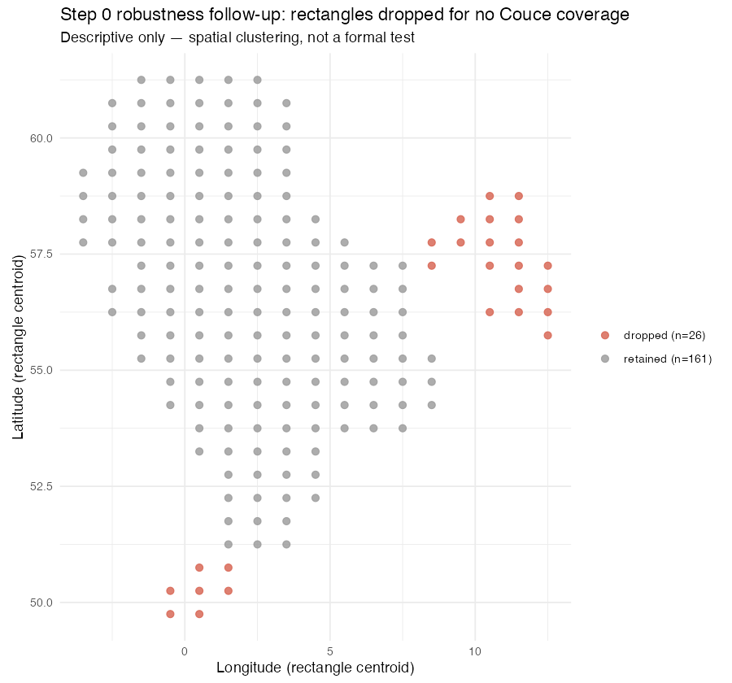

# Step 0 robustness follow-ups

Generated: 2026-07-20 — addendum to `step0_robustness_check.md`. Does not modify Step 0 or the prior robustness-check outputs. Reported descriptively / uninterpreted.

## 1. Linear vs loess max deviation

PRESENT in outputs/step0_robustness_linear_vs_loess.csv (and in step0_robustness_check.md Check 3) — was NOT actually missing; not re-run with different parameters.

| max_abs_diff | at_fishing_hours | linear_fitted_at_max | loess_fitted_at_max | loess_span | n_grid_points | n |
|---|---|---|---|---|---|---|
| 0.0443 | 1095.129 | 0.6111 | 0.5668 | 0.75 | 200 | 161 |

## 2. Haul-count verification (26 dropped rectangles)

| n_rectangles | min_n_hauls | median_n_hauls | max_n_hauls | min_hauls_threshold | all_meet_threshold |
|---|---|---|---|---|---|
| 26 | 6 | 59 | 150 | 5 | TRUE |

## 3. Spatial / temporal characterisation of the 26 dropped rectangles

Overlap between the 26 dropped `stat_rec` and Couce's own rectangle list (any year): **0 of 26**.
This confirms the gap is a rectangle-level spatial coverage gap (these stat_rec codes never
appear in Couce's data in any year), not a year-specific temporal gap within an otherwise-covered rectangle.

**Ecoregion breakdown** (ICES `ICES_Statistical_Rectangles_Eco.shp`, primary Ecoregion by max spatial overlap %):

| group | Ecoregion | n_rectangles | pct |
|---|---|---|---|
| dropped (n=26) | Greater North Sea | 25 | 96.2 |
| dropped (n=26) | Baltic Sea | 1 | 3.8 |
| retained (n=161) | Greater North Sea | 149 | 92.5 |
| retained (n=161) | Celtic Seas | 12 | 7.5 |

**Geographic bounding box (degrees):**

| group | n_rectangles | lat_min | lat_max | lon_min | lon_max |
|---|---|---|---|---|---|
| dropped | 26 | 49.5 | 59.0 | -1 | 13 |
| retained | 161 | 51.0 | 61.5 | -4 | 9 |

**Descriptive spatial clustering** (not a formal cluster analysis) among the 26:

| descriptive_cluster | n_rectangles |
|---|---|
| north-eastern edge (~55.5-59N, Skagerrak/Kattegat approach) | 19 |
| southern edge (~49.5-51N, English Channel approach) | 7 |

**Haul-year coverage of the 26 dropped rectangles:**

| n | earliest_year_min_seen | latest_year_max_seen | n_full_1985_2015_coverage |
|---|---|---|---|
| 26 | 1985 | 2015 | 14 |

Couce's coverage window is also 1985-2015 (`data/external/couce_trawling_effort/DATA_SOURCE.md`) and Step 0's own aggregation already restricts hauls to 1985-2015, so the year range itself cannot explain the gap. Combined with the 0/26 stat_rec overlap above, the gap reads as spatial (these rectangles are outside Couce's ~215-rectangle grid), not a temporal-window mismatch.

No existing repo file (`DATA_SOURCE.md`, `pipeline/README.md`, `h2_couce_import_diagnostics.csv`) explicitly documents which rectangles Couce's reconstruction excludes, so this characterisation required new descriptive analysis rather than confirming a pre-existing note.

## Notes on scope

- Descriptive only, as instructed — no conclusion drawn about whether this affects H2's validity.
- The two-cluster grouping above is a simple coordinate-based descriptive split (thresholds chosen
  by inspection of the bounding boxes), not a statistical clustering method.

*Outputs: `outputs/step0_robustness_haulcount_check.csv`, `outputs/step0_robustness_missing_rectangles_geo.csv`,
`outputs/step0_robustness_ecoregion_breakdown.csv`, `outputs/figures/step0_robustness_missing_rectangles_map.png`.*
